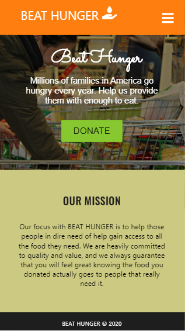
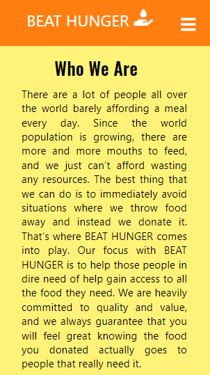
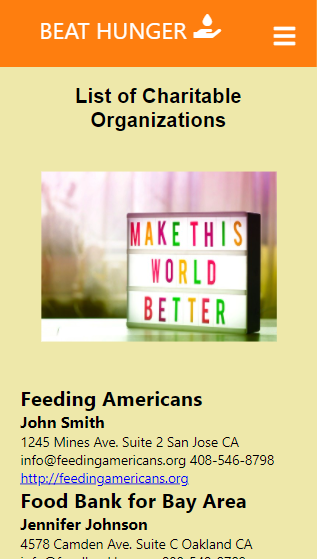
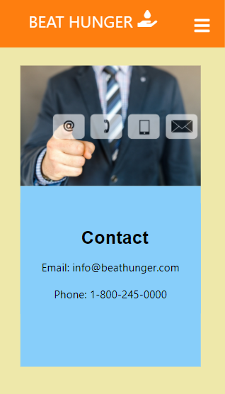
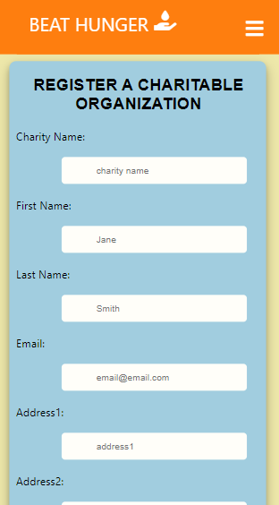

### Title: 
This project is called Beat Hunger.

### URL: 
[Beat Hunger](https://cranky-benz-b56cef.netlify.app/).

### Objective: 
Our focus with BEAT HUNGER is to help those people in dire need of help gain access to all the food they need. It will connect the food donors and organizations that collect food for the needy. We are heavily committed to quality and value, and we always guarantee that you will feel great knowing the food you donated actually goes to people that really need it.

I used Netlify and Heroku to deploy my server and client. I used postgresql to deploy my database.

### Images

### Summary
If the user is a charitable organization, they need to register in order to add the charity name and information on the website so that when people want to donate, they can just go to Charity page and choose which charity they want to donate. The information will be available so they can contact them directly. 

### Technology Used
HTML, CSS, React, Node, Express, and PostgreSQL.